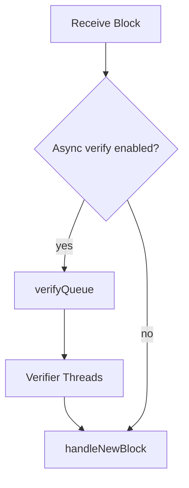
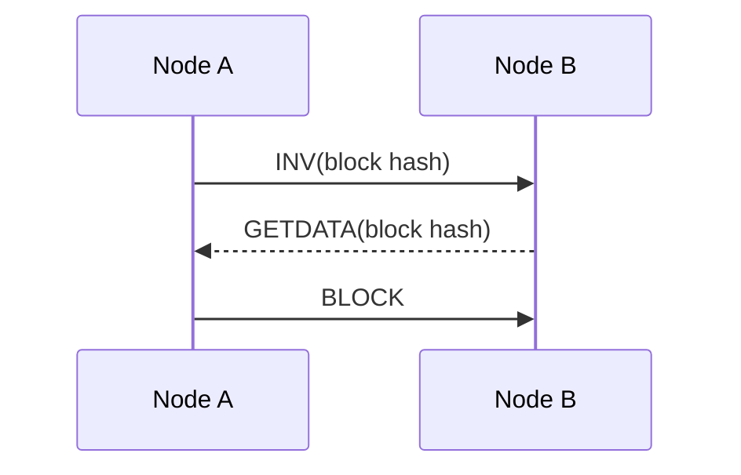
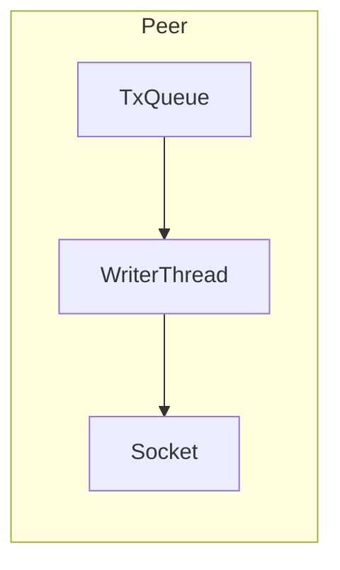

# AlynCoin Architecture

## Async Verifier Flow

## INV/GETDATA Handshake

## Per-Peer Writer Threads

### Network Scaling Features
- **Async verification threads** scale with `verify_threads` (default: twice CPU cores).
- **Orphan pool** holds up to 5000 blocks and retries them when parents arrive.
- **Rate limiter** drops messages from noisy peers using a token bucket.
